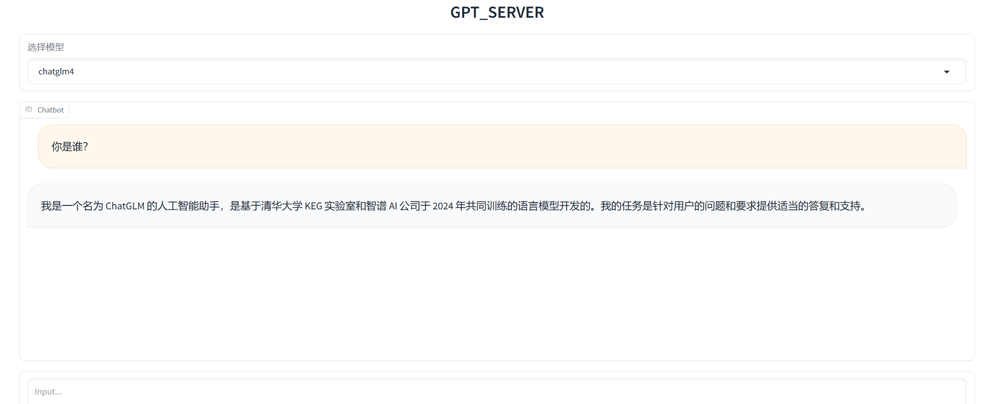

<div align="center">

<a href="https://github.com/shell-nlp/gpt_server"></a>

# GPT Server

</div>

本项目依托fastchat的基础能力来提供**openai server**的能力.

1. **在此基础上完美适配了更多的模型**，**优化了fastchat兼容较差的模型**
2. 支持了**Function Calling (Tools)** 能力（现阶段支持Qwen/ChatGLM，对Qwen支持更好）
3. 重新适配了vllm对模型适配较差，导致解码内容和hf不对齐的问题。
4. 支持了**vllm**、**LMDeploy**和**hf**的加载方式
5. 支持所有兼容sentence_transformers的语义向量模型（Embedding和Reranker）
6. 支持了Infinity后端，推理速度大于onnx/tensorrt，支持动态组批
7. Chat模板无角色限制，使其完美支持了**LangGraph Agent**框架
8. 支持多模态大模型
9. **降低了模型适配的难度和项目使用的难度**(新模型的适配仅需修改低于5行代码)，从而更容易的部署自己最新的模型。

（仓库初步构建中，构建过程中没有经过完善的回归测试，可能会发生已适配的模型不可用的Bug,欢迎提出改进或者适配模型的建议意见。）

<br>

## 特色

1. 支持多种推理后端引擎，vLLM和LMDeploy，**LMDeploy**后端引擎，每秒处理的请求数是 vLLM 的 1.36 ~ 1.85 倍
2. 支持了Infinity后端，推理速度大于onnx/tensorrt，支持动态组批
3. 全球唯一完美支持**Tools（Function Calling）**功能的开源框架。兼容**LangChain**的 **bind_tools**、**AgentExecutor**、**with_structured_output**写法（目前支持Qwen系列、GLM系列）
4. 全球唯一扩展了**openai**库,实现Reranker模型。(代码样例见gpt_server/tests/test_openai_rerank.py)
5. 支持多模态大模型
6. 与FastChat相同的分布式架构

## 更新信息

```plaintext
8-17  支持了 vllm/hf 后端的 lora 部署
8-14  支持了 InternVL2 系列多模态模型
7-28  支持embedding/reranker 的动态组批加速（infinity后端, 比onnx/tensorrt更快）
7-19  支持了多模态模型 glm-4v-gb 的LMDeploy PyTorch后端
6-22  支持了 Qwen系列、ChatGLM系列 function call (tools) 能力
6-12  支持了 qwen-2
6-5   支持了 Yinka、zpoint_large_embedding_zh 嵌入模型
6-5   支持了 glm4-9b系列（hf和vllm）
4-27  支持了 LMDeploy 加速推理后端
4-20  支持了 llama-3
4-13  支持了 deepseek
4-4   支持了 embedding模型 acge_text_embedding
3-9   支持了 reranker 模型 （ bge-reranker，bce-reranker-base_v1）
3-3   支持了 internlm-1.0 ,internlm-2.0
3-2   支持了 qwen-1.5 0.5B, 1.8B, 4B, 7B, 14B, and 72B
2-4   支持了 vllm 实现
1-6   支持了 Yi-34B
12-31 支持了 qwen-7b, qwen-14b
12-30 支持了 all-embedding(理论上支持所有的词嵌入模型)
12-24 支持了 chatglm3-6b 
```

## 路线

* [X] 支持HF后端
* [X] 支持vLLM后端
* [X] 支持LMDeploy后端
* [X] 支持 function call 功能 (tools)（Qwen系列、ChatGLM系列已经支持,后面有需求再继续扩展）
* [X] 支持多模态模型（初步支持glm-4v,其它模型后续慢慢支持）
* [X] 支持Embedding模型动态组批(实现方式：infinity后端)
* [X] 支持Reranker模型动态组批(实现方式：infinity后端)
* [ ] 内置部分 tools (image_gen,code_interpreter,weather等)
* [ ] 并行的function call功能（tools）

## 启用方式

### Python启动

#### 1. 配置python环境

```bash

# 1. 创建conda 环境
conda create -n gpt_server python=3.10

# 2. 激活conda 环境
conda activate gpt_server

# 3. 安装仓库（一定要使用 install.sh 安装,否则无法解决依赖冲突）
sh install.sh
```

#### 2. 修改启动配置文件

修改模型后端方式（vllm,lmdeploy等）

config.yaml中：

```bash
work_mode: vllm  # vllm hf lmdeploy-turbomind  lmdeploy-pytorch
```

修改embedding/reranker后端方式（embedding或embedding_infinity）

config.yaml中：

```bash
model_type: embedding # embedding 或 embedding_infinity  embedding_infinity后端速度远远大于 embedding
```

[config.yaml](https://github.com/shell-nlp/gpt_server/blob/main/gpt_server/script/config.yaml "配置文件")

```bash
cd gpt_server/script
vim config.yaml
```

```yaml
serve_args:
  host: 0.0.0.0
  port: 8082

models:
  - chatglm4:  #自定义的模型名称
      alias: null # 别名     例如  gpt4,gpt3
      enable: true  # false true
      model_name_or_path: /home/dev/model/THUDM/glm-4-9b-chat/
      model_type: chatglm  # qwen  chatglm3 yi internlm
      work_mode: vllm  # vllm hf lmdeploy-turbomind  lmdeploy-pytorch
      # lora:  # lora 配置
      #   test_lora: /home/dev/project/LLaMA-Factory/saves/Qwen1.5-14B-Chat/lora/train_2024-03-22-09-01-32/checkpoint-100
      device: gpu  # gpu / cpu
      workers:
      - gpus:
        # - 1
        - 0
  
  - qwen:  #自定义的模型名称
      alias: gpt-4,gpt-3.5-turbo,gpt-3.5-turbo-16k # 别名     例如  gpt4,gpt3
      enable: true  # false true
      model_name_or_path: /home/dev/model/qwen/Qwen1___5-14B-Chat/ 
      model_type: qwen  # qwen  chatglm3 yi internlm
      work_mode: vllm  # vllm hf lmdeploy-turbomind  lmdeploy-pytorch
      device: gpu  # gpu / cpu
      workers:
      - gpus:
        - 1
      # - gpus:
      #   - 3

  # Embedding 模型
  - bge-base-zh:
      alias: null # 别名   
      enable: true  # false true
      model_name_or_path: /home/dev/model/Xorbits/bge-base-zh-v1___5/
      model_type: embedding # embedding_infinity 
      work_mode: hf
      device: gpu  # gpu / cpu
      workers:
      - gpus:
        - 2
 # reranker 模型
  - bge-reranker-base:
      alias: null # 别名   
      enable: true  # false true
      model_name_or_path: /home/dev/model/Xorbits/bge-reranker-base/
      model_type: embedding # embedding_infinity
      work_mode: hf
      device: gpu  # gpu / cpu
      workers:
      - gpus:
        - 2
```

#### 3. 运行命令

[start.sh](https://github.com/shell-nlp/gpt_server/blob/main/gpt_server/script/start.sh "服务主文件")

```bash
cd gpt_server/script
sh start.sh
```

## 支持的模型以及推理后端

**推理速度：** LMDeploy TurboMind > vllm > LMDeploy PyTorch > HF

### **LLM**

|    Models / BackEnd    | HF | vllm | LMDeploy TurboMind | LMDeploy PyTorch |
| :--------------------: | :-: | :--: | :----------------: | :--------------: |
|      chatglm4-9b      | √ |  √  |         √         |        √        |
|      chatglm3-6b      | √ |  √  |         ×         |        √        |
| Qwen (7B, 14B, etc.)) | √ |  √  |         √         |        √        |
|  Qwen-1.5 (0.5B--72B)  | √ |  √  |         √         |        √        |
|         Qwen-2         | √ |  √  |         √         |        √        |
|         Yi-34B         | √ |  √  |         √         |        √        |
|      Internlm-1.0      | √ |  √  |         √         |        √        |
|      Internlm-2.0      | √ |  √  |         √         |        √        |
|        Deepseek        | √ |  √  |         √         |        √        |
|        Llama-3        | √ |  √  |         √         |        √        |
|        Baichuan-2        | √ |  √  |         √         |        √        |

### **VLM** (视觉大模型榜单 https://rank.opencompass.org.cn/leaderboard-multimodal)

| Models / BackEnd | HF | vllm | LMDeploy TurboMind | LMDeploy PyTorch |
| :--------------: | :-: | :--: | :----------------: | :--------------: |
|    glm-4v-9b    | × |  ×  |         ×         |        √        |
|    InternVL2    | × |  ×  |         √         |        √        |

<br>

### Embedding模型

**原则上支持所有的Embedding/Rerank 模型**

**推理速度：** Infinity >> HF

以下模型经过测试：

| Embedding/Rerank          | HF | Infinity |
| ------------------------- | -- | -------- |
| bge-reranker              | √ | √       |
| bce-reranker              | √ | √       |
| bge-embedding             | √ | √       |
| bce-embedding             | √ | √       |
| piccolo-base-zh-embedding | √ | √       |
| acge_text_embedding       | √ | √       |
| Yinka                     | √ | √       |
| zpoint_large_embedding_zh | √ | √       |
| xiaobu-embedding          | √ | √       |

目前 **xiaobu-embedding** C-MTEB榜单排行第一(MTEB: https://huggingface.co/spaces/mteb/leaderboard)

#### 4. 使用 openai 库 进行调用

**见 gpt_server/tests 目录 样例测试代码:
https://github.com/shell-nlp/gpt_server/tree/main/tests**

#### 5. 使用WebUI

```bash
cd gpt_server/tests
python web_demo.py
```

WebUI界面:



### Docker安装

#### 1. 构建镜像

```bash
docker build --rm -f "Dockerfile" -t gpt_server:latest "." 
```

#### 2. Docker Compose启动

```bash
docker-compose  -f "docker-compose.yml" up -d --build gpt_server
```

## 致谢

 [FastChat](https://github.com/lm-sys/FastChat) : https://github.com/lm-sys/FastChat

 [vLLM](https://github.com/vllm-project/vllm)   : https://github.com/vllm-project/vllm

[LMDeploy ](https://github.com/InternLM/lmdeploy)： https://github.com/InternLM/lmdeploy

[infinity](https://github.com/michaelfeil/infinity) ： https://github.com/michaelfeil/infinity

## Star History

[](https://star-history.com/#shell-nlp/gpt_server&Date)
