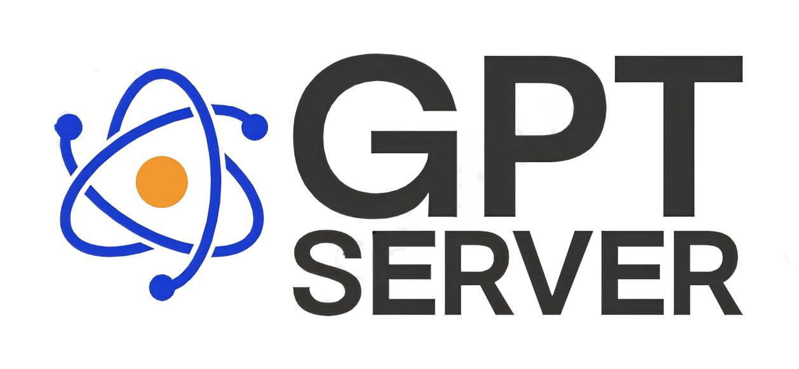
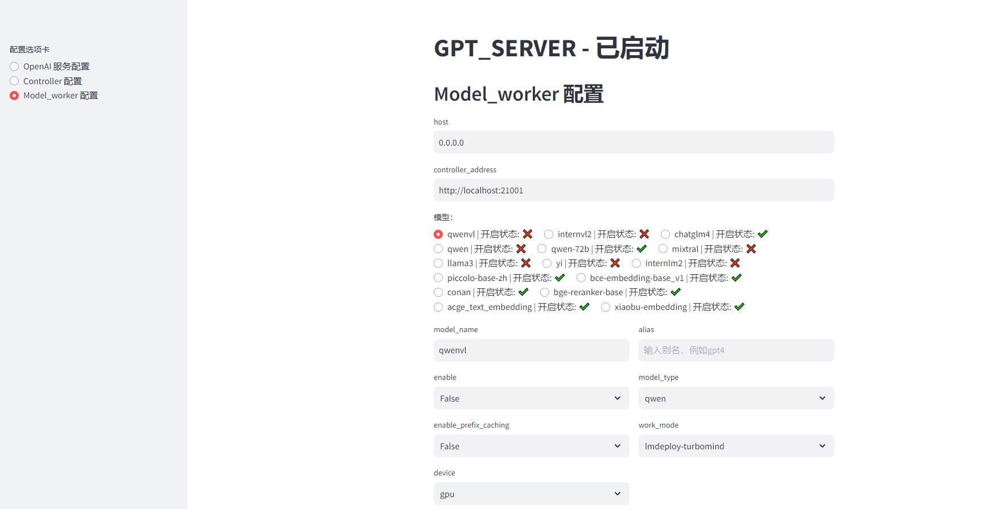
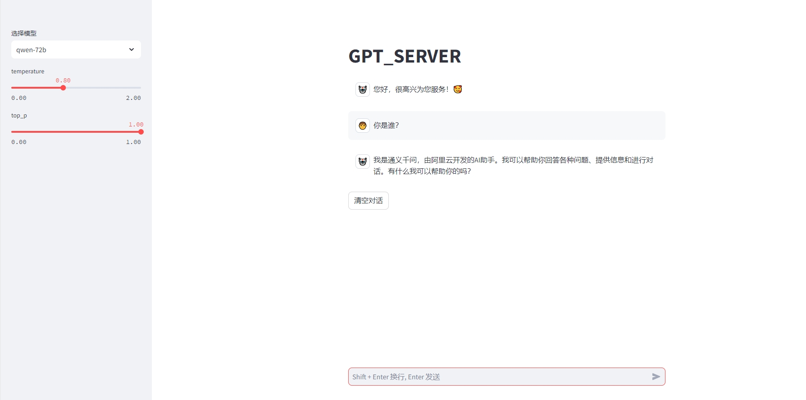
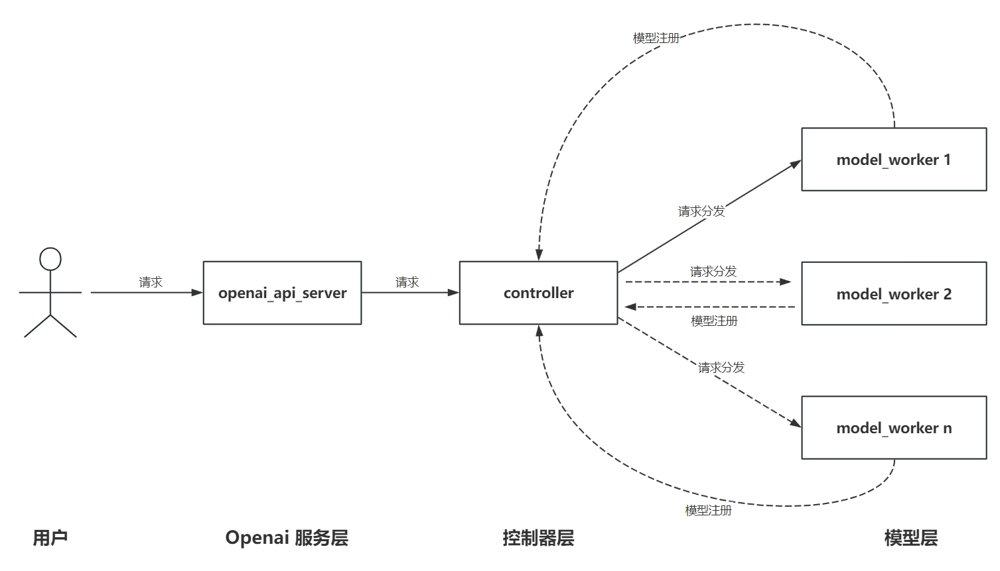

<div align="center">

<a href="https://github.com/shell-nlp/gpt_server"></a>

# GPT Server
[![License][license-shield]][license-url]
[![Stars][stars-shield]][stars-url]
[![Forks][forks-shield]][forks-url]
[![Docker pulls][docker-pulls]][docker-pulls]
[![CI Status][ci-shield]][ci-url]
[![issue resolution][closed-issues-shield]][closed-issues-url]

</div>

本项目依托fastchat的基础能力来提供**openai server**的能力.

1. 支持**Chat**、**Embedding**、**ReRanker**、**text-moderation（文本审核，分类）**、**ASR**、**TTS（支持声音克隆）**、**SD(Stable Diffusion,文生图、文生视频、图片编辑、)** 模型的 **openai**规范 接口服务。
2. 支持**HF**、**vLLM**、**LMDeploy**和**SGLang** 多种加速推理后端引擎。
3. 多个模型共用**openai server**的同一个端口进行调用，自动进行模型调度。

如果 GPT Server 对您有帮助，欢迎留下一个 ⭐ Star！
<br>

## ✨ 功能亮点
|     | 功能          | 说明                                                                |
|-----|-------------|-------------------------------------------------------------------|
| 🎨  | **OpenAI服务接口**     | 支持 `OpenAI` 服务接口规范，兼容所有支持 OpenAI的项目工程                                          |
| 💎  | **支持 `Responses API` 接口**     | 全球首个兼容 `OpenAI`  `Responses API` 接口                |
| 🚀  | **多后端引擎推理** | 支持 `vLLM`、`SGLang`、`LMDeploy`、`HF`多种高性能推理引擎 |
| 🎯  | **Embedding/Reranker** | 支持所有兼容`Sentence_Transformers`的语义向量或重排模型，支持了Infinity后端，**Embedding**推理速度大于onnx/tensorrt，支持动态组批 |
| 🎛️ | **Text-moderation（文本审核，分类）**   | 支持`OpenAI` 服务接口规范的文本审核，分类                                                |
| 📱  | **ASR(语音转文本)**    | 支持基于`FunASR`的ASR模型                                        |
| 🔊  | **TTS(文本转语音)**   | 支持基于`SparkTTS`的TTS模型，支持基于`vLLM`、`SGLang`后端对齐加速，`RTF<<1`,支持流式音频流输出                                          |
| 🖌️  | **SD(Stable Diffusion,文生图)**    | 支持基于`diffusers`的 `文生图` 模型                                        |
| 🏔️  | **SD(Stable Diffusion,图片编辑)**    | 支持基于`diffusers`的 `图片编辑` 模型                                        |
| 🔄  | **支持LM/VL模型**  | 支持多种大语言模型或多模态语言模型                                              |
| 🎭  | **推理服务性能测试**   | 基于`Evalscope`实现`Throughput`、`TTFT`、`TPOT`等服务性能指标                                                  |

<br>

### 其它特性
- 支持了`cohere`库接口规范的 /v1/rerank 接口,在dify中可用。
- 扩展了`OpenAI`库,实现Reranker模型（rerank, /v1/rerank）。(代码样例见gpt_server/tests/test_openai_rerank.py)
- 支持了`OpenAI`库的文本审核模型接口（text-moderation, /v1/moderations）。(代码样例见gpt_server/tests/test_openai_moderation.py)
- 支持了`OpenAI`库的TTS模型接口（tts, /v1/audio/speech）(代码样例见gpt_server/tests/test_openai_tts_stream.py)
- 支持了`OpenAI`库的ASR模型接口（asr, /v1/audio/transcriptions）,基于fanasr后端(代码样例见gpt_server/tests/test_openai_transcriptions.py)
- 支持了`OpenAI`库的SD,文生图模型接口（sd, /v1/images/generations）,基于diffusers后端(代码样例见gpt_server/tests/test_image_gen.py)
- 支持了`OpenAI`库的SD,文生图模型接口（sd, /v1/images/edits）,基于diffusers后端(代码样例见gpt_server/tests/test_image_edit.py)


## 📘 配置文档 


- **[GPT Server - DeepWiki文档（可直接AI提问使用方式）](https://deepwiki.com/shell-nlp/gpt_server "deepwiki文档")**
<br>

- **[配置详细说明](https://blog.csdn.net/q506610466/article/details/151360406 "详细配置说明")**
<br>

- [配置文件样例](https://github.com/shell-nlp/gpt_server/blob/main/gpt_server/script/config_example.yaml "配置文件")

## 🎉 最新进展
<details open>
<summary><b>2025</b></summary>
 
```plaintext
2025-11-30 支持了 z-image 文生图 模型
2025-11-16 支持了 jinaai/jina-reranker-v3 模型
2025-10-25 支持了 qwen_image 文生图模型
2025-9-7   支持了 文本编辑模型 (代码样例见gpt_server/tests/test_image_edit.py)
2025-8-8   初步支持了 embedding 的 vllm 加速
2025-6-17  支持了 jina-reranker-m0 全球首个支持多模态多语言的重排模型
2025-6-12  支持了 文生图模型 flux (代码样例见gpt_server/tests/test_image_gen.py)
2025-6-6   支持了 bge-vl 系列 (代码样例见gpt_server/tests/test_openai_embedding_vl.py)
2025-6-6   支持了 ritrieve_zh_v1
2025-4-29  支持了 Qwen3
2025-4-24  支持了 Spark-TTS后端的 TTS
2025-4-14  支持了 SGLang后端以及部分VL模型
2025-4-2   支持了 OpenAI的ASR接口 /v1/audio/transcriptions
2025-4-1   支持了 internvl2.5模型
2025-2-9   支持了 QVQ
```
</details>

<details close>
<summary><b>2024</b></summary>
 
```plaintext
2024-12-22 支持了 tts, /v1/audio/speech TTS模型
2024-12-21 支持了 text-moderation, /v1/moderations 文本审核模型 
2024-12-14 支持了 phi-4
2024-12-7  支持了 /v1/rerank 接口
2024-12-1  支持了 QWQ-32B-Preview
2024-10-15 支持了 Qwen2-VL
2024-9-19  支持了 minicpmv 模型
2024-8-17  支持了 vllm/hf 后端的 lora 部署
2024-8-14  支持了 InternVL2 系列多模态模型
2024-7-28  支持了 embedding/reranker 的动态组批加速（infinity后端, 比onnx/tensorrt更快）
2024-7-19  支持了多模态模型 glm-4v-gb 的LMDeploy PyTorch后端
2024-6-22  支持了 Qwen系列、ChatGLM系列 function call (tools) 能力
2024-6-12  支持了 qwen-2
2024-6-5   支持了 Yinka、zpoint_large_embedding_zh 嵌入模型
2024-6-5   支持了 glm4-9b系列（hf和vllm）
2024-4-27  支持了 LMDeploy 加速推理后端
2024-4-20  支持了 llama-3
2024-4-13  支持了 deepseek
2024-4-4   支持了 embedding模型 acge_text_embedding
2024-3-9   支持了 reranker 模型 （ bge-reranker，bce-reranker-base_v1）
2024-3-3   支持了 internlm-1.0 ,internlm-2.0
2024-3-2   支持了 qwen-1.5 0.5B, 1.8B, 4B, 7B, 14B, and 72B
2024-2-4   支持了 vllm 实现
2024-1-6   支持了 Yi-34B
```
</details>

<details close>
<summary><b>2023</b></summary>
 
```plaintext
2023-12-31 支持了 qwen-7b, qwen-14b
2023-12-30 支持了 all-embedding(理论上支持所有的词嵌入模型)
2023-12-24 支持了 chatglm3-6b 
```
</details>

## 🧭 路线

* [X] 支持HF后端
* [X] 支持vLLM后端
* [X] 支持LMDeploy后端
* [X] 支持SGLang后端
* [X] 支持 文本转语音 TTS 模型
* [X] 支持 语音转文本 ASR 模型
* [X] 支持 文本审核 模型
* [X] 支持 function call 功能 (tools)（Qwen系列、ChatGLM系列已经支持,后面有需求再继续扩展）
* [X] 支持多模态模型
* [X] 支持Embedding模型动态组批(实现方式：infinity后端)
* [X] 支持Reranker模型动态组批(实现方式：infinity后端)
* [X] 可视化启动界面(不稳定,对开发人员来说比较鸡肋，后期将弃用！)
* [X] 支持 文生图 模型
* [X] 支持 图片编辑 模型
* [X] 支持 Responses API


## ⚙️ 快速开始

### 1. 配置python环境

#### 1.1 uv 方式 安装 (推荐,迄今最优秀的 库 管理工具, 性能和易用性远高于 pip、conda、poetry等,各大优秀开源项目都在使用。)

```bash
# 安装 uv 
pip install uv -U # 或查看教程 https://docs.astral.sh/uv/getting-started/installation/#standalone-installer
# uv venv --seed # （可选）创建 uv 虚拟环境，并设置seed
uv sync
source .venv/bin/activate # 激活 uv 环境
```

#### 1.2 conda  方式 安装(后期将弃用，可选)

```bash
# 1. 创建conda 环境
conda create -n gpt_server python=3.11

# 2. 激活conda 环境
conda activate gpt_server

# 3. 安装仓库（一定要使用 install.sh 安装,否则无法解决依赖冲突）
bash install.sh
```

### 2. 修改启动配置文件

#### 2.1 复制样例配置文件:
**配置文件的详细说明信息位于：[config_example.yaml](https://github.com/shell-nlp/gpt_server/blob/main/gpt_server/script/config_example.yaml "配置文件")**

```bash
# 进入script目录
cd gpt_server/script
# 复制样例配置文件
cp config_example.yaml config.yaml
```

### 3. 启动服务
#### 3.1 命令启动

```bash
uv run gpt_server/serving/main.py
```
或者
```bash
sh gpt_server/script/start.sh
```
或者
```bash
python gpt_server/serving/main.py
```

#### 3.2 Docker启动

##### 3.2.0 拉取Docker Hub镜像
```bash
docker pull 506610466/gpt_server:latest # 如果拉取失败可尝试下面的方式
# 如果国内无法拉取docker镜像，可以尝试下面的国内镜像拉取的方式（不保证国内镜像源一直可用）
docker pull docker.1ms.run/506610466/gpt_server:latest
```
##### 3.2.1 直接使用Docker命令直接启动
```bash
docker run -d \
  --name gpt_server \
  --restart always \
  --shm-size 32g \
  --network host
  -v your_model_path/:your_model_path/ \
  -v your_config_path/config.yaml:/gpt_server/gpt_server/script/config.yaml \
  --gpus all \
  docker.1ms.run/506610466/gpt_server:latest  \
  python gpt_server/serving/main.py  
```

将`your_model_path`替换为你的模型路径，且要和`config.yaml`中配置的路径一致
将`your_config_path`替换为你`config.yaml`文件的路径


##### 3.2.2 手动构建镜像并使用Docker Compose 启动（可选）

```bash
docker-compose  -f "docker-compose.yml" up -d --build gpt_server
```

<details close>
<summary> <b> 3.3 可视化UI方式启动服务（有Bug，已弃用，欢迎大佬优化代码）</b></summary>

#### 3.3 可视化UI方式启动服务（可选,有Bug，不建议使用，欢迎大佬优化代码）

```bash
cd gpt_server/serving
streamlit run server_ui.py
```

##### 3.3.1 Server UI界面:



</details>

### 4. 使用 openai 库 进行调用

**见 gpt_server/tests 目录 样例测试代码:
https://github.com/shell-nlp/gpt_server/tree/main/tests**

### 5. 使用Chat UI

```bash
cd gpt_server/gpt_server/serving
streamlit run chat_ui.py
```

Chat UI界面:




## ⚡ 支持的模型以及推理后端

**推理速度：** LMDeploy TurboMind > SGLang > vllm > LMDeploy PyTorch > HF

### 推理后端官方支持模型情况


[LMDeploy](https://lmdeploy.readthedocs.io/en/latest/supported_models/supported_models.html) 

[vLLM](https://docs.vllm.ai/en/latest/models/supported_models.html) 

[SGLang](https://docs.sglang.ai/supported_models/generative_models.html) 

#### 注意：
- **现可以通过在 `config.yaml`中 设置 `model_type: auto`** 支持所有vllm/sglang/lmdeploy 当前版本已经支持的大语言模型和多模态语言模型。

- 下面的项目兼容表未来将移除或者重构，没有在表中的模型也可能兼容，实际情况情参考官方。

### **LLM**

|   Models / BackEnd    | model_type |  HF   | vllm  | LMDeploy TurboMind | LMDeploy PyTorch | SGLang |
| :-------------------: | :--------: | :---: | :---: | :----------------: | :--------------: | :----: |
|      chatglm4-9b      |  chatglm   |   √   |   √   |         √          |        √         |   √    |
|      chatglm3-6b      |  chatglm   |   √   |   √   |         ×          |        √         |   √    |
|   Qwen-1.0--3.0       |    qwen    |   √   |   √   |         √          |        √         |   √    |
|        Yi-34B         |     yi     |   √   |   √   |         √          |        √         |   √    |
|    Internlm-1.0--2.0  |  internlm  |   √   |   √   |         √          |        √         |   √    |
|       Deepseek        |  deepseek  |   √   |   √   |         √          |        √         |   √    |
|        Llama-3        |   llama    |   √   |   √   |         √          |        √         |   √    |
|      Baichuan-2       |  baichuan  |   √   |   √   |         √          |        √         |   √    |
|        QWQ-32B        |    qwen    |   √   |   √   |         √          |        √         |   √    |
|         Phi-4         |    phi     |   √   |   √   |         ×          |        ×         |   √    |
### **VLM** (视觉大模型榜单 https://rank.opencompass.org.cn/leaderboard-multimodal)

| Models / BackEnd | model_type |  HF   | vllm  | LMDeploy TurboMind | LMDeploy PyTorch | SGLang |
| :--------------: | :--------: | :---: | :---: | :----------------: | :--------------: | :----: |
|    glm-4v-9b     |  chatglm   |   ×   |   ×   |         ×          |        √         |   ×    |
|    InternVL2     |  internvl  |   ×   |   ×   |         √          |        √         |   ×    |
|InternVL2.5--3.5  |  internvl  |   ×   |   ×   |         √          |        √         |   ×    |
|  MiniCPM-V-2.6   |  minicpmv  |   ×   |   √   |         √          |        ×         |   ×    |
|  MiniCPM-V-4.5   |  minicpmv  |   ×   |   √   |         ×          |        ×         |   ×    |
|     Qwen-VL 2.0--3.0     |    qwen    |   ×   |   √   |         √         |        √         |   √    |
|       QVQ        |    qwen    |   ×   |   √   |         √          |        √         |   √    |
<br>

### Embedding/Rerank/Classify模型

**原则上支持所有的Embedding/Rerank/Classify模型**

**推理速度：** infinity > sentence_transformers

以下模型经过测试可放心使用：

| Models / BackEnd                                                                    | sentence_transformers  | infinity | vllm|
| ----------------------------------------------------------------------------------- | --------------- | -------------- |----------- |
| bge-m3                                                                              | √   | √        |√        |
| bge-embedding                                                                       | √   | √        |√        |
| bce-embedding                                                                       | √   | √        |√        |
| puff                                                                                | √   | √        |√        |
| piccolo-base-zh-embedding                                                           | √   | √        |√        |
| acge_text_embedding                                                                 | √   | √        |√        |
| Yinka                                                                               | √   | √        |√        |
| zpoint_large_embedding_zh                                                           | √   | √        |√        |
| xiaobu-embedding                                                                    | √   | √        |√        |
| Conan-embedding-v1                                                                  | √   | √        |√        |
| qwen3-embedding                                                                     | √   | √        |√        |
| ritrieve_zh_v1                                                                      | √   | √        |√        |
| jina-embeddings-v3                                                                  | √   | √        |√        |
| KoalaAI/Text-Moderation（文本审核/多分类，审核文本是否存在暴力、色情等）                | ×   | √         |×        |
| protectai/deberta-v3-base-prompt-injection-v2（提示注入/2分类，审核文本为提示注入）    | ×   | √         |×        |
| bge-vl                                                                              | √   | ×        |×        |
| jina-reranker-m0                                                                    | √   | ×        |×        |
| bge-reranker                                                                        | √   | √        |×        |
| bce-reranker                                                                        | √   | √        |×        |
| jina-reranker-v3                                                                     | √   | ×        |×        |

目前 **ritrieve_zh_v1** C-MTEB榜单排行第一(MTEB: https://huggingface.co/spaces/mteb/leaderboard)

<br>

### **ASR** (支持FunASR非实时模型 https://github.com/modelscope/FunASR/blob/main/README_zh.md)
目前只测试了SenseVoiceSmall模型（性能最优的），其它模型的支持情况只是从官方文档中拷贝过来，不一定可以正常使用，欢迎测试/提issue。

|    Models / BackEnd    | model_type |
| :--------------------: | :--------: |
|    SenseVoiceSmall     |   funasr   |
|     paraformer-zh      |   funasr   |
|     paraformer-en      |   funasr   |
|      conformer-en      |   funasr   |
|    Whisper-large-v3    |   funasr   |
| Whisper-large-v3-turbo |   funasr   |
|       Qwen-Audio       |   funasr   |
|    Qwen-Audio-Chat     |   funasr   |

<br>

### **TTS** 模型

| Models / BackEnd | model_type |
| :--------------: | :--------: |
|    Spark-TTS     | spark_tts  |


<br>

### **文生图** 模型
[Flux 模型地址](https://huggingface.co/black-forest-labs/FLUX.1-dev)
[z-image 模型地址](https://modelscope.cn/models/Tongyi-MAI/Z-Image-Turbo)

| Models / BackEnd | model_type |
| :--------------: | :--------: |
|    flux     | flux  |
|    qwen_image     | qwen_image  |
|    z_image     | z_image  |

<br>

### **图片编辑** 模型
[Qwen-Image-Edit 模型地址](https://huggingface.co/Qwen/Qwen-Image-Edit)

| Models / BackEnd | model_type |
| :--------------: | :--------: |
|Qwen-Image-Edit   | qwen_image_edit  |

<br>

## 🏗️ 架构



## 🤝 致谢
- [FastChat](https://github.com/lm-sys/FastChat) 
- [vLLM](https://github.com/vllm-project/vllm)  
- [LMDeploy ](https://github.com/InternLM/lmdeploy)
- [SGLang ](https://github.com/sgl-project/sglang)
- [infinity](https://github.com/michaelfeil/infinity) 
- [FlashTTS](https://github.com/HuiResearch/FlashTTS) 

## 📲 与我联系(会邀请进入交流群)


## 🌟 Star History

[](https://star-history.com/#shell-nlp/gpt_server&Date)

[open-issues-url]: https://github.com/shell-nlp/gpt_server/issues
[open-issues-shield]: https://img.shields.io/github/issues-raw/shell-nlp/gpt_server
[closed-issues-shield]: https://img.shields.io/github/issues-closed-raw/shell-nlp/gpt_server
[closed-issues-url]: https://github.com/shell-nlp/gpt_server/issues

[forks-url]: https://github.com/shell-nlp/gpt_server/network/members
[forks-shield]: https://img.shields.io/github/forks/shell-nlp/gpt_server?color=9cf
[stars-url]: https://github.com/shell-nlp/gpt_server/stargazers
[stars-shield]: https://img.shields.io/github/stars/shell-nlp/gpt_server?color=yellow
[license-url]: https://github.com/shell-nlp/gpt_server/blob/main/LICENSE
[license-shield]: https://img.shields.io/github/license/shell-nlp/gpt_server
[docker-pulls]: https://img.shields.io/docker/pulls/506610466/gpt_server
[ci-shield]: https://github.com/shell-nlp/gpt_server/actions/workflows/docker-image.yml/badge.svg
[ci-url]: https://github.com/shell-nlp/gpt_server/actions/workflows/docker-image.yml
